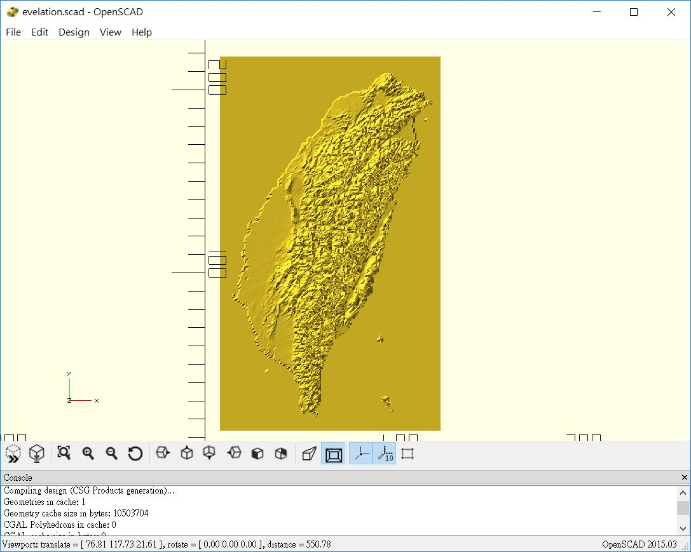

# elevation2scad

Generate OpenSCAD source code from elevation data. I don't provide code for getting elevation data because providers might have their own license. You need to write your own for getting that.

Save your elevation data into `elevations.dat` with the format `longitude  latitude  elevation` and order by `[longitude, latitude].`

After `elevations.dat` is ready, run `python genscad.py`. Use [OpenSCAD](https://www.openscad.org/) to open the generated `evelation.scad` which requires my library [dotSCAD](https://github.com/JustinSDK/dotSCAD). 

The model shown below is [Taiwan](https://www.google.com.tw/maps/place/%E5%8F%B0%E7%81%A3/@23.6558232,120.3439706,8.04z/data=!4m5!3m4!1s0x346ef3065c07572f:0xe711f004bf9c5469!8m2!3d23.69781!4d120.960515), generated from data that latitude from 21.75 to 25.500 and longitude from 119.900 to 122.100.

